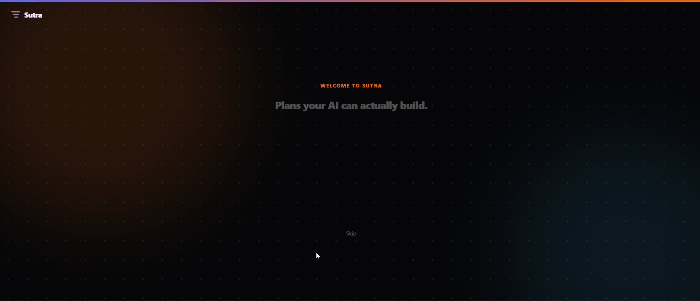

# Ashesh

Product manager by day, developer by night. QA and DevOps in a past life.

  
  
  

<b>Some highlights from my professional journey</b>

 

Eight years in broadcast and public safety software:

- Currently leading a flagship project for my organization
- Leading an AI Assisted Software Development team as a Product Manager
- Owned roadmap across platform infrastructure, cloud-native apps, and broadcast control systems
- Led a unified deployment platform for hybrid cloud and on-prem environments
- Built an org-wide logging standard so customers and support could share logs directly, reducing incident triage time
- Moved manual QA teams onto automated pipelines, with security verification built into the test stage

---

## Sutra

Spec governance for teams shipping with AI. Security review of the spec, cost estimation and visualization, code generation with drift detection.

  
  
  
  

<a href="https://sutrasdd.app"> Spec Driven Development for Humans and your Agentic Team. </a>

---

## LTCM

Self-hosted test case management for small QA teams. Run sessions with history and diffs, Jira integration, CSV and PDF export.

  
  
  
  
  

---

<b>Also building</b>

 

**[journ.ai](https://github.com/CorithLabs/journ.ai)** — AI powered travel planner and journal. Scratching my own itch.

**[cent-cent-go](https://github.com/CorithLabs/cent-cent-go)** — Byte-byte-go, but for stocks. A learning tool I'm building for myself.

---

Ottawa, Canada
